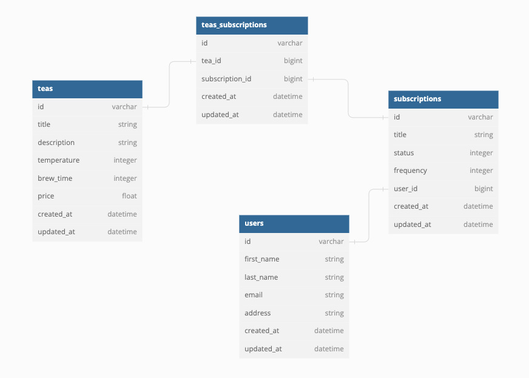

# README - Rails Engine API

## About the Project
 This project is a MVP Backend Application for a Tea Subscription Application. It allows for users to see all available teas then add multiple teas to a subscription with a chosen order frequency. The user is also able to view all the subscriptions they have set up and stop a subscription from continuing.

## Built With
This project used `Ruby 2.7.4`

- with Rails `5.2.x`
- and used `PostgreSQL`

## Gems

## Setup/Install

- Fork this repository
- Clone your fork
- From the command line, install gems and set up your DB:
  - Run `bundle install`
  - Run `rails db:{create,migrate,seed}`
- Run the test suite with `bundle exec rspec`.
## Deployment
- In terminal (apple or integrated)
    * `rails s`
- Navigate to desired API endpoint as noted below
## Database Structure

## Table of Contents for End Points

- [Get all Subscriptions for a User](#get-all-subscriptions-for-a-user)
## End Points

### Get all Subscriptions for a User

